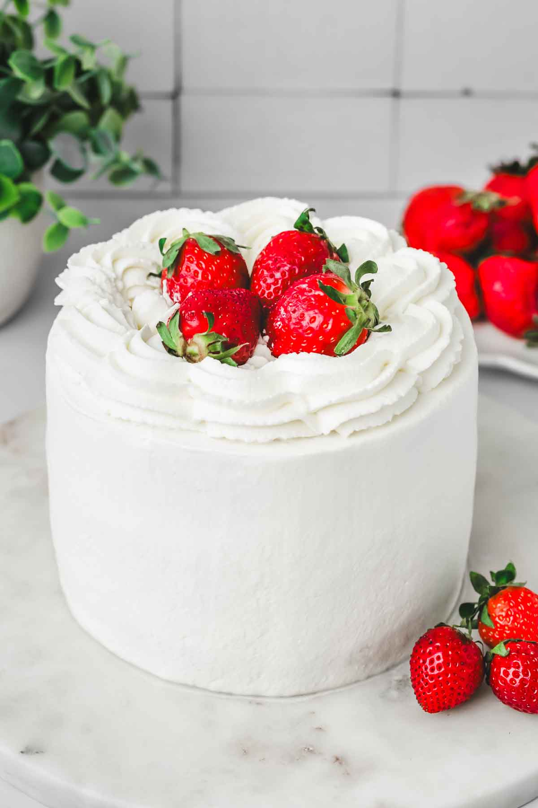

# Strawberry Cream Cake

This strawberry cream cake is a sweet and tasty dessert. It has soft cake, fresh strawberries, and light whipped cream. It’s perfect for any event or just as a special treat. Everyone will love how good it tastes and how nice it looks!

## Ingredients
- 2 cups flour  
- 1 cup sugar  
- 1/2 cup butter (softened)  
- 2 eggs  
- 1 tsp vanilla extract  
- 1 cup milk  
- 1 tsp baking powder  
- Fresh strawberries  
- Whipped cream  

## Procedure
1. Preheat the oven to 350°F (175°C). Allow it to heat for at least 10 minutes to reach the right temperature.  
2. In a large bowl, mix 2 cups of flour, 1 cup of sugar, and 1 tsp of baking powder. Add 1/2 cup of softened butter and blend until the mixture is crumbly.  
3. Add 2 eggs, 1 tsp of vanilla extract, and 1 cup of milk to the bowl. Stir well until the batter is smooth and lump-free.  
4. Grease a baking pan with butter or non-stick spray. Pour the batter into the pan, spreading it evenly with a spatula.  
5. Bake the cake for 30-35 minutes. Check if it’s ready by inserting a toothpick into the center—if it comes out clean, it’s done. Let the cake cool completely on a wire rack (about 20-30 minutes).  
6. While the cake cools, whip heavy cream (add sugar if desired) until stiff peaks form, or use store-bought whipped cream.  
7. Spread the whipped cream evenly over the top of the cooled cake using a spatula or knife.  
8. Wash and dry fresh strawberries. Slice them or leave them whole and arrange them beautifully on top of the whipped cream.  
9. Slice the cake with a sharp knife and serve. Enjoy your strawberry cream cake!  

